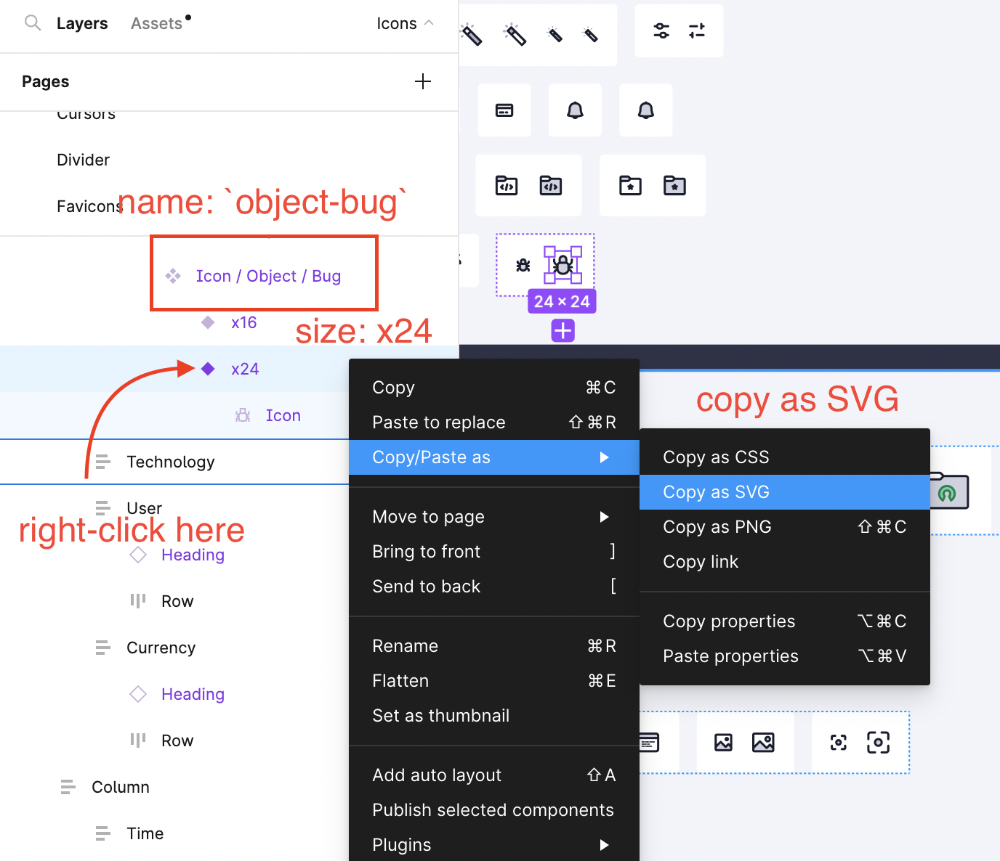

# Cypress Design System

## Usage

### See the docs

The storybooks on this repo are published after any commit to the main branch to

https://design.cypress.io

### Install windicss

First install the css package

```bash
npm install --save-dev @cypress-design/css
```

Then, add the plugins to your bundler

```js
// webpack.config.js
import { CyCSSWebpackPlugin } from '@cypress-design/css'

export default (config) => ({
  // the rest of the webpack config...
  plugins: [
    //...
    CyCSSWebpackPlugin(),
  ],
})
```

See [the css package ReadMe](./css/) for more options

### Install each component independently

To make sure each component fix is never blocked by an ongoing refactoring, we decided to publish each component as its own package.

If you want to install the Cypress Button, run

```bash
npm install @cypress-design/vue-button
```

At Cypress, we prefer using Vuejs to build new apps.

Since some projects at Cypress already use React as a framework, we decided to still publish each component as a react version and a vue version.

If you want to install the Cypress Button, and your project still uses React, install the react version

```bash
npm install @cypress-design/react-button
```

See [the component ReadMe](./components/) for the list of available components and [the docs](https://cypress-design.vercel.app) for their usage

## Contributing

### Running storybook

Open all the storybooks with this command

```bash
yarn start
```

This will start all 3 storybooks.

There are 3 storybooks running on this repo.

- [Intro](./storybook/intro/), contains all the common facts Colors, voice & tone, contrast information and how to use the component libraries
- [React](./storybook/react/), contains all the components usable in a react app
- [Vue](./storybook/vue/), documents the same components in a vue app

The 3 storybooks are linked using [storybook composition](https://storybook.js.org/docs/react/sharing/storybook-composition).

If you only want to run vue storybook, run the command below. Use the same fashion if you want to only run react.

```bash
yarn storybook:vue
```

### Create a new component

Using [hygen](https://hygen.io) we can scaffold all the tooling needed for a new components.

To start writing a new component, run this command:

```bash
yarn new:component
```

The system will ask you to provide the name of the component and generate all the files needed to start writing it.

In the new directory, you will find a React and a Vuejs version to complete. Each framework folder will also contain a stories file.

### Adding a new icon

New icons should be added to the `icon-registry/icons` directory and named according to the format `<category>-<icon-name>_x<size>.svg`, for example, `object-bug_x24.svg`.

When grabbing the icon from Figma, make sure the width and height of the icon is equal to its name (e.g. `x24` icons should be 24x24px). If it isn't, try going up a layer in Figma.

The name and size should match what's shown in Figma.



Once added, the svg attributes should be tweaked so as to integrate with the icon generation tooling.

- Replace main color with `currentColor`
- Add `class="icon-dark"` to paths that are dark, generally the strokes
- Add `class="icon-light"` to paths that are light, generally the fills
- Remove the `width` and `height` attributes of the SVG

To verify that the icon is properly hooked up, run `yarn start` and navigate to the `icons` page. Search for your icon and tweak the colors. If you need to adjust the attributes you can run `yarn build:icons` and storybook will update with the latest changes.

When an icon is added or updated, the changeset for both the '@cypress-design/react-icon' and '@cypress-design/vue-icon' packages should include a minor version bump.

### Updating the component generator

When you use the `yarn new:component` command, the template used is called a generator. It could be useful to update it from time to time if the standards change.

First, create a scaffold for a component called ComponentName. The name matters because it will be used to generate the component templates and overwrite the old ones.

```bash
yarn new:component --name ComponentName
```

Then do all the changes you want to make to the component template.

Every time you use `ComponentName` in this template, it will be replaced in generated scaffolding.

Finally, to commit the changes to the template, run

```bash
# Remove the old template
rm -rf _templates/component/new
# start a new hygen-create session
npx hygen-create start component
# add all the files inside the component to the template
npx hygen-create add components/ComponentName/**/*
# remove the file automatically generated by hygen-create
npx hygen-create remove hygen-create.json
# Use ComponentName as a placeholder for the component name
npx hygen-create usename ComponentName
# generate the new template
npx hygen-create generate
# remove the temporary component
rm -rf components/ComponentName
# remove the metadata file
rm -f hygen-create.json
```

Finally, you should see the `prompt.js` file has been moved. Revert that change before committing.

### Running tests

To run in open mode, run `yarn workspace components cypress:open`.

To run in CLI, run `yarn workspace components cypress:run`.

## Structure

- [components](./components/) A collection of components for building Cypress applications and websites.
- [css](./css/) What you need to install a pre-configured version of WindiCSS in a Cypress project.
- [icon-registry](./icon-registry/) contains the list of all the svg icons available in the vue-icon and react-icon components.
- [storybook-vue](./storybook-vue/) The configuration of a storybook to showcase and work on the vue components.
- [storybook-react](./storybook-react/) The same as above but for React components.
- [test](./test/) A sanity check to see if the components we build are actually working with a real setup.
